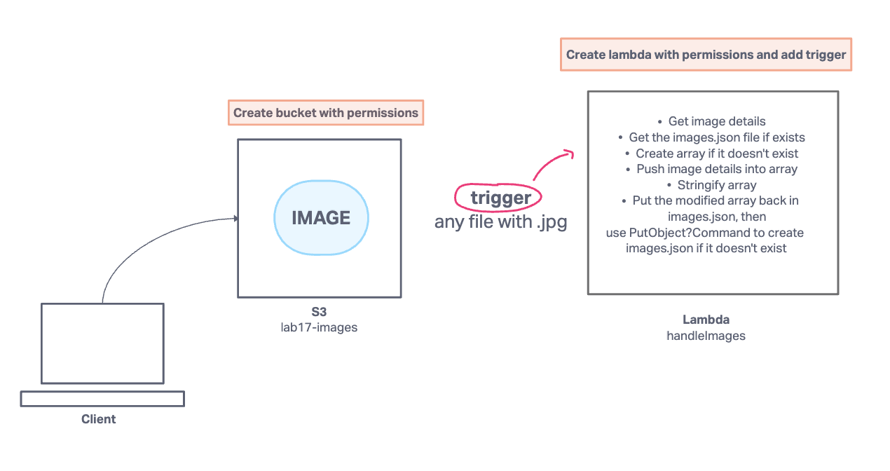

# image-lambda

## project

Lab 17 - S3 bucket that allows user to upload image and when they do, it will trigger a Lambda function

### Collaborators

Ryan in lecture video

### Process

Feature Tasks
Create an S3 Bucket with “open” read permissions, so that anyone can see the images/files in their browser.
A user should be able to upload an image at any size, and update a dictionary of all images that have been uploaded so far.
When an image is uploaded to your S3 bucket, it should trigger a Lambda function which must:
Download a file called “images.json” from the S3 Bucket if it exists.
The images.json should be an array of objects, each representing an image. Create an empty array if this file is not present.
Create a metadata object describing the image.
Name, Size, Type, etc.
Append the data for this image to the array.
Note: If the image is a duplicate name, update the object in the array, don’t just add it.
Upload the images.json file back to the S3 bucket.

### UML

